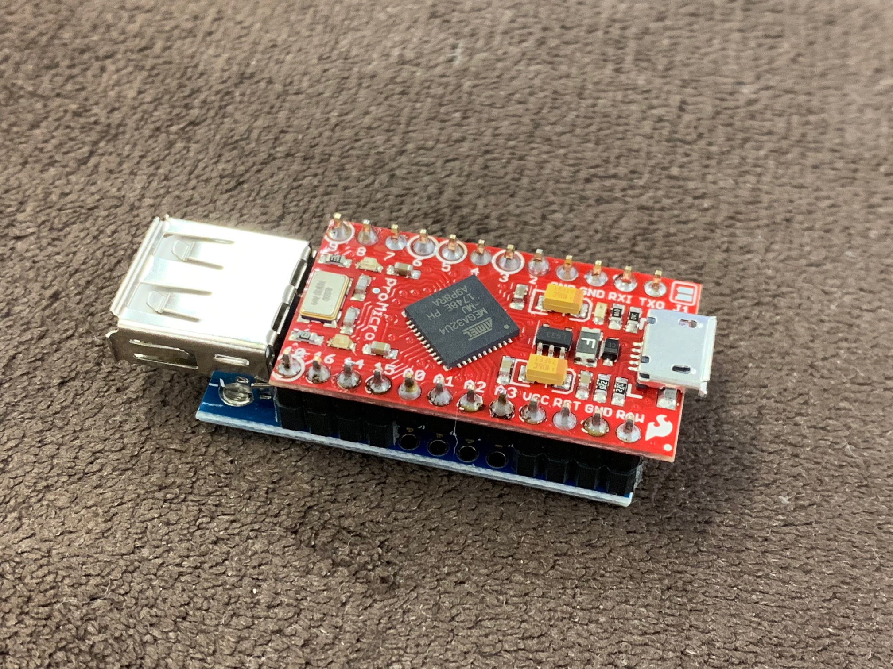
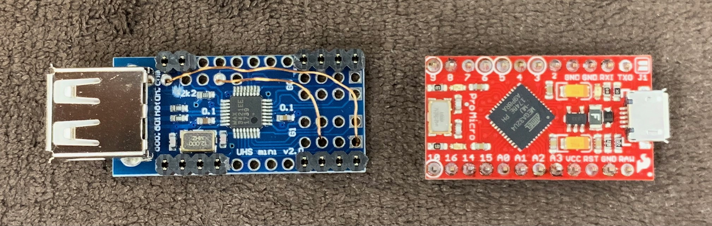
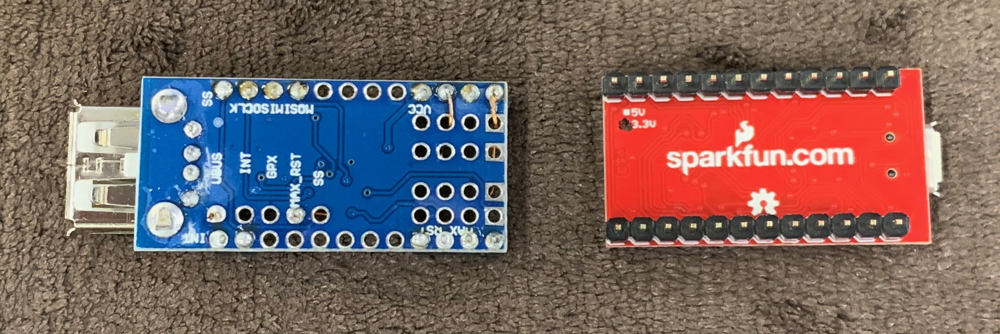

# keyboard jp-us converter

ThinkPad USB トラックポイントキーボード(US) 55Y9003 用につくったjp-usのコンバータ。

USB host shield と [Pro Micro 3.3V/8MHz](https://www.switch-science.com/catalog/1622/) を利用しています

## ユースケース

モブプロ

- 相手のマシンが日本語キーボードのときにUSキーボードで参戦できる
- マウスを奪わなくてもトラックポイントで戦える

## 制約事項

- バックスラッシュ(`\`)が入力できない